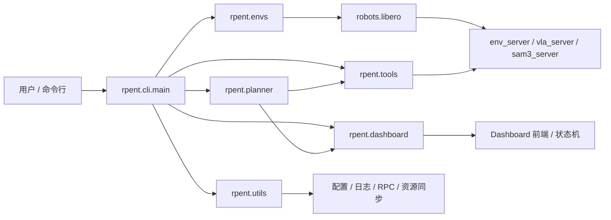
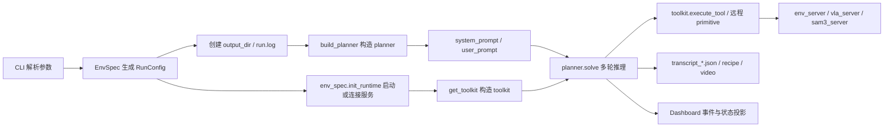

# RPent 技术概览

本文档面向新成员与开发者，用于快速理解 RPent 的整体架构、运行链路、关键模块职责与二次开发入口。内容基于当前仓库源码静态分析整理；少量外部运行环境细节无法从仓库直接确认的地方，已用 `[需补充]` 标记。

## 第一部分：项目架构分析

### 1. 项目整体架构

#### 项目目录树

```text
RPent/
├─ pyproject.toml
├─ README.md
├─ README.zh-CN.md
├─ docs/
│  ├─ source-en/
│  └─ source-zh/
├─ robots/
│  └─ libero/
├─ rpent/
│  ├─ cli/
│  ├─ context/
│  ├─ dashboard/
│  ├─ envs/
│  ├─ planner/
│  ├─ tools/
│  └─ utils/
├─ scripts/
│  └─ codex_proxy/
└─ tests/
```

#### 核心模块及职责说明

| 模块 | 职责 | 关键依赖 |
|---|---|---|
| `rpent/cli/main.py` | 统一 CLI 入口，串联环境、planner、toolkit、日志和可选 Dashboard | `argparse`、`rpent.envs`、`rpent.planner`、`rpent.tools`、`rpent.dashboard`、`rpent.utils` |
| `rpent/cli/dashboard.py` | Dashboard 会话启动器，负责长生命周期会话与单任务运行调度 | `DashboardServer`、`DashboardSessionController`、`EnvSpec` |
| `rpent/envs/` | 环境契约层，定义 `EnvSpec` / `RunConfig` / `PromptBundle`，并按需加载 `robots.<env>` | `importlib`、`robots.*` |
| `rpent/planner/` | LLM / SDK planner 后端，负责多轮推理与工具调用循环 | `pydantic-ai`、`claude-agent-sdk`、`openai-codex` |
| `rpent/tools/` | Tool 容器与共享工具，向 planner 暴露统一工具协议 | `Toolkit`、`ToolResult`、文件 IO 工具 |
| `rpent/dashboard/` | FastAPI 服务、运行状态投影、交互协议与前端事件流 | `FastAPI`、`uvicorn`、状态机、事件总线 |
| `robots/libero/` | 当前仓库内的参考环境实现，包含 LIBERO 的 env / VLA / SAM3 启动与工具适配 | `env_server`、`vla_server`、`sam3_server`、Libero 工具 |
| `rpent/utils/` | 配置、日志、资源同步、RPC、Daemon 进程管理等底层支撑 | `httpx`、`huggingface_hub`、`subprocess` 封装 |
| `tests/` | 行为回归测试，覆盖 Dashboard 会话与图片读取等关键路径 | `pytest`、mock |

#### 技术栈与关键依赖

| 技术栈 | 作用 | 对应位置 |
|---|---|---|
| `pydantic-ai-slim` | API planner 的工具调用循环与模型适配 | `rpent/planner/api_loop.py` |
| `claude-agent-sdk` | Claude Code planner 后端 | `rpent/planner/claude_code.py` |
| `openai-codex` | Codex planner 后端 | `rpent/planner/codex.py` |
| `FastAPI` + `uvicorn` | Dashboard HTTP 服务 | `rpent/dashboard/server.py` |
| `prompt-toolkit` | 交互式终端输入 | `rpent/cli/tui.py` |
| `httpx` / Socket RPC | 环境服务与模型服务的远程调用 | `rpent/utils/http_rpc.py`、`rpent/utils/socket_rpc.py` |
| `huggingface_hub` | 环境资源同步 | `rpent/utils/resources.py` |
| `numpy` / `imageio` / MuJoCo 相关外部栈 | 机器人与视觉数据处理、录制和仿真支撑 | `robots/libero/*`、外部环境包 `[需补充]` |

#### Mermaid：模块依赖关系



#### Mermaid：数据流



### 2. 模块详细说明

#### `rpent/cli/main.py`

- 功能描述：项目主入口 `rpent`，负责两阶段参数解析、环境加载、planner 构造、runtime 启动、toolkit 初始化与收尾记录。
- 模块间接口定义与调用关系：
  - `get_env_spec(args.env_name)` 获取环境定义。
  - `env_spec.add_cli_args(parser, use_dashboard=...)` 将环境专属参数挂到共享 parser。
  - `env_spec.parse_config(args)` 返回 `RunConfig`，包含 `recipe_tag`、`output_dir`、`prompt_vars`、`task_desc`。
  - `build_planner(...)` 根据 `--planner` 选择 `api` / `claude_code` / `codex`。
  - `env_spec.init_runtime(...)` 返回 `daemons` 与 `primitives_kwargs`。
  - `get_toolkit(...)` 使用 `primitives_kwargs` 组装环境工具集。
- 关键类 / 函数说明：
  - `_build_argparser()`：定义通用 CLI 参数。
  - `_serialize_messages()`：在写入 transcript 前去除内嵌图片 payload。
  - `main()`：调度整个运行流程。
- 配置文件作用与参数说明：
  - `--env`：当前仅允许 `libero`。
  - `--planner`：`api`、`claude_code`、`codex`。
  - `--model`：`api` planner 需要 provider 前缀，例如 `anthropic:claude-opus-4-8`。
  - `--dashboard` 与 `--interactive` 互斥。

#### `rpent/cli/dashboard.py`

- 功能描述：为“一个长生命周期 Dashboard 会话”提供启动器，支持连续的 TaskRun、共享服务复用与任务切换。
- 模块间接口定义与调用关系：
  - `DashboardServer.start()` 先启动前端与 API。
  - `wait_for_launch()` 阻塞等待 launcher 提交配置。
  - `DashboardSessionController.run()` 负责共享服务启动、任务接管与清理。
  - `_run_dashboard_task()` 在每个 TaskRun 内构造 `toolkit` 与 `planner`，并把事件写回 `DashboardState`。
- 关键类 / 函数说明：
  - `run_dashboard_session()`：Dashboard 会话入口。
  - `_run_dashboard_task()`：单个任务执行入口。
- 配置文件作用与参数说明：
  - `--dashboard-host`、`--dashboard-port`、`--dashboard-language` 控制本地监控服务。
  - `--env-endpoint` 在 Dashboard task control 场景下被禁止，因为每个任务都需要新的 owned env_server。

#### `rpent/envs/env_spec.py` 与 `rpent/envs/prompt_bundle.py`

- 功能描述：环境契约层。`EnvSpec` 负责环境身份、prompt bundle 与 runner hooks；`PromptBundle` 负责把 Python prompt 树渲染成最终文本。
- 模块间接口定义与调用关系：
  - `EnvSpec.add_cli_args(parser, use_dashboard)`：注册环境专属 CLI flags。
  - `EnvSpec.parse_config(args)`：校验参数并生成 `RunConfig`。
  - `EnvSpec.init_runtime / init_shared_runtime / init_task_runtime`：启动或连接进程级服务。
  - `PromptBundle.render("system" | "user", variables=...)`：把模板变量注入到 system/user prompt。
- 关键类 / 函数说明：
  - `EnvSpec`：环境描述对象，携带 `name`、`prompts`、`dashboard` 和 runner 钩子。
  - `RunConfig`：单次运行的派生配置。
  - `format_prompt()`（在 `rpent.context.prompt_utils` 中）：渲染嵌套 prompt 结构。
- 配置文件作用与参数说明：
  - 环境自身的 CLI 参数由 `robots/libero/__init__.py` 注册。
  - `PromptBundle` 对应的模板变量主要来自 `RunConfig.prompt_vars`。

#### `rpent/planner/base.py`

- 功能描述：定义 planner 的抽象协议与统一构造入口 `build_planner()`。
- 模块间接口定义与调用关系：
  - `Planner.solve(...)` 是 planner 的统一调用协议。
  - `PlannerResult` 统一承载 `finish_result`、`messages`、`stats`、`error`。
  - `build_planner()` 根据 backend 选择具体实现，并注入输出目录、模型名、超时与 dashboard 事件 sink。
- 关键类 / 函数说明：
  - `add_mcp_prefix()` / `strip_mcp_prefix()`：规范 MCP 工具命名空间。
  - `PlannerResult`：可序列化的任务结果载体。
  - `Planner`：多轮推理协议。

#### `rpent/planner/api_loop.py`

- 功能描述：基于 `pydantic-ai` 的通用工具调用循环，支持普通运行、交互式运行与 Dashboard 交互。
- 模块间接口定义与调用关系：
  - 通过 `Toolkit.get_tools_spec()` 暴露工具 schema。
  - 通过 `Toolkit.execute_tool()` 执行工具。
  - 通过 `DashboardInteractionPort` 接收 Dashboard 输入、暂停与中断。
- 关键类 / 函数说明：
  - `ApiAgentLoop.solve(...)`：运行一次或多次 agent 回合。
  - `read_image()`：为模型读取图片文件，测试覆盖了缺失文件、目录、权限错误与相对路径解析。
- 配置文件作用与参数说明：
  - `--max-tokens` 控制模型单轮输出上限。
  - `--planner-timeout-s` 控制墙钟时间上限；交互式 API 会话有特殊豁免逻辑。
  - `--no-images` 可把图像输入降级为文本路径提示，适配不接受图像输入的模型。

#### `rpent/planner/claude_code.py`

- 功能描述：Claude Agent SDK 后端。它把 toolkit 以 SDK 方式接入，记录原始 stream、渲染输出并汇总 stats。
- 模块间接口定义与调用关系：
  - `ClaudeCodePlanner.solve(...)` 创建 SDK session。
  - `_Recorder` 观察消息流并抽取 finish / usage / transcript。
  - 在 Dashboard 场景下通过 `DashboardPlannerControl` 接收交互与消息排队。
- 关键类 / 函数说明：
  - `ClaudeCodePlanner`：Claude Code planner 实现。
  - `_solve_async()`：真正驱动 SDK 调用的协程。

#### `rpent/planner/codex.py`

- 功能描述：OpenAI Codex SDK 后端。它通过进程内 HTTP MCP 服务暴露 RPent 工具，并在独立线程里驱动 Codex 会话。
- 模块间接口定义与调用关系：
  - `HttpMcpServer(toolkit)` 提供 MCP HTTP endpoint。
  - `CodexPlanner.solve(...)` 发起会话并收集输出、raw stream 与最后一条消息。
  - 通过 `DashboardPlannerControl` 接收 Dashboard 交互。
- 关键类 / 函数说明：
  - `CodexPlanner`：Codex planner 实现。
  - `PROVIDER_ID` / `PROVIDER_ENV_KEY`：Codex 代理相关配置标识。

#### `rpent/tools/toolkit.py` 与 `rpent/tools/common.py`

- 功能描述：`Toolkit` 是 planner 面向的统一工具容器；`common.py` 注册跨环境通用工具。
- 模块间接口定义与调用关系：
  - `Toolkit.add_tool(name, spec, handler)` 注册 schema 与 handler。
  - `Toolkit.get_tools_spec()` 返回 planner 可见的工具定义。
  - `Toolkit.execute_tool(name, input_dict)` 负责分发并包装异常。
  - `common.TOOLS_SPEC` / `TOOL_HANDLERS` 提供 `read_text_file`、`write_text_file`、`list_dir`、`finish`。
- 关键类 / 函数说明：
  - `ToolResult`：把原始结果转换为 LLM 可消费的 content blocks。
  - `ToolCancelled`：工具取消边界异常。
  - `finish()`：终止 agent loop 的标记工具。
- 配置文件作用与参数说明：
  - `finish` 返回的 `_finish` 字段会被各 planner 识别为结束信号。
  - `list_dir` 默认作用于当前 `output_dir`。

#### `rpent/dashboard/server.py`、`state.py`、`interaction.py`、`events.py`

- 功能描述：Dashboard 三层结构。
  - `server.py` 负责 FastAPI 路由、静态页面与 launcher。
  - `state.py` 负责会话状态机、任务切换、消息队列与运行投影。
  - `interaction.py` 定义 planner 可依赖的交互接口。
  - `events.py` 定义 planner/toolkit/runtime 向 Dashboard 上报的事件类型。
- 模块间接口定义与调用关系：
  - planner / toolkit 通过 `DashboardEventSink.emit(...)` 推送事件。
  - Dashboard planner 通过 `DashboardInteractionPort` 读取用户消息、暂停与中断。
  - `DashboardServer` 暴露 `/api/*` 路由并注册 `DashboardState`。
- 关键类 / 函数说明：
  - `DashboardServer`：Dashboard HTTP 服务。
  - `DashboardState`：线程安全状态投影。
  - `DashboardPlannerControl`：planner 侧控制器 `[需补充]`（位于 `rpent/dashboard/planner_control.py`）。
  - `TranscriptEvent`、`UsageEvent`、`RuntimeStatusEvent`、`ToolResultEvent`、`RunStartedEvent`：Dashboard 事件载体。
- 配置文件作用与参数说明：
  - `robots/libero/spec.py` 定义 dashboard task 命令 ` /rpent-task <suite> <task> <seed>`。
  - `DashboardServer` 的 `language` 仅支持 `en` 与 `zh-cn`。

#### `robots/libero/__init__.py` 与 `robots/libero/spec.py`

- 功能描述：LIBERO 参考环境实现。它把 CLI 参数、运行配置、环境进程启动、VLA/SAM3 服务与工具适配串起来。
- 模块间接口定义与调用关系：
  - `get_env_spec()` 返回 `EnvSpec`，对接 `PromptBundle`、CLI 参数、运行配置和 Dashboard 规格。
  - `get_toolkit(...)` 返回 `LiberoToolkit`。
  - `init_runtime(...)`：启动或连接 `env_server`、`vla_server`、`sam3_server`，返回 primitive 客户端。
  - `init_shared_runtime(...)`：Dashboard 场景下复用 VLA 与 SAM3。
  - `init_task_runtime(...)`：Dashboard 场景下为每个任务创建独立 env runtime。
- 关键类 / 函数说明：
  - `_add_cli_args()`：注册 `--suite`、`--task`、`--seed`、`--libero-type`、`--env-endpoint`、`--vla-endpoint`、`--sam3-endpoint`、`--cuda-device`。
  - `_parse_config()`：根据 suite/task/seed 生成 `recipe_tag` 与 `output_dir`。
  - `LIBERO_DASHBOARD_SPEC`：Dashboard 可识别的任务命令、runtime component、frame channel 规格。
- 配置文件作用与参数说明：
  - `LIBERO_SUITE_NAMES` 是 Dashboard launcher 的下拉候选集。
  - `--libero-type` 支持 `standard` / `pro` / `plus`，默认由 `LIBERO_TYPE` 环境变量决定。
  - `--env-endpoint`、`--vla-endpoint`、`--sam3-endpoint` 都支持 `http` 或 `socket` 协议。

#### `rpent/utils/config.py`、`logging.py`、`resources.py`

- 功能描述：基础配置、日志与资源同步。
- 模块间接口定义与调用关系：
  - `get_repo_root()` 用于解析仓库根目录。
  - `init_output_dir()` 创建输出目录并配置 `run.log`。
  - `ensure_resources(env_name)` 尝试从 HuggingFace 同步 `resources/<env_name>/`。
- 关键类 / 函数说明：
  - `get_libero_type()`：读取 `LIBERO_TYPE`。
  - `get_pi05_checkpoint_path()`：读取 `PI05_CHECKPOINT_PATH`。
  - `get_rlinf_repo_path()`：读取 `RPENT_RLINF_ROOT` 或 `RLINF_REPO_PATH`。
- 配置文件作用与参数说明：
  - `RPENT_REPO_ROOT`：显式指定仓库根目录。
  - `RPENT_RESOURCES_HF_REPO`：资源同步的数据集仓库，默认 `RLinf/RPent-memory`。
  - `HF_HUB_OFFLINE=1`：跳过在线同步，仅用本地资源。

#### `tests/`

- `tests/test_api_dashboard_session.py`：验证 Dashboard 输入、任务替换与消息状态流转。
- `tests/test_api_read_image.py`：验证 `read_image` 的文件缺失、目录、权限错误与相对路径解析。

### 3. 代码组织逻辑

#### 命名规范与文件组织原则

- 模块、函数、变量统一使用 `snake_case`。
- 类与数据结构使用 `PascalCase`，例如 `EnvSpec`、`PlannerResult`、`DashboardState`。
- 工厂函数前缀多为 `get_` / `build_` / `init_` / `run_`，用于明确“获取 / 构建 / 初始化 / 执行”的职责边界。
- 大文件内的生命周期步骤会用注释分段，例如 `# --- env_server ---`、`# --- toolkit ---`、`# --- agent loop ---`。

#### 使用的设计模式

- 工厂模式：`get_env_spec()`、`get_toolkit()`、`build_planner()` 统一构造抽象对象。
- 适配器 / 端口模式：`DashboardInteractionPort`、`DashboardEventSink`、`Planner` 协议把具体实现与调用方解耦。
- 策略模式：`api`、`claude_code`、`codex` 三种 planner backend 可替换。
- 事件总线模式：toolkit、runtime、planner 通过事件对象向 Dashboard 发送状态。
- 命令模式：tool 名称及其 schema 代表可执行动作，planner 通过工具名调度具体能力。
- Lazy import：重依赖只在需要时导入，避免循环依赖与启动期开销。

#### 数据流与控制流说明

1. CLI 先解析 `--env` 与 `--dashboard`，再由 `EnvSpec` 注入环境参数。
2. `parse_config()` 产出本次运行的派生配置，包括输出目录与 prompt 变量。
3. `init_output_dir()` 创建输出目录并绑定 `run.log`。
4. `ensure_resources()` 同步环境资源，再按 planner 类型构建推理后端。
5. `init_runtime()` 启动或连接 `env_server` / `vla_server` / `sam3_server`。
6. `get_toolkit()` 生成工具容器，planner 只看到统一的工具 schema。
7. planner 轮询模型输出，触发工具调用，并把事件写入 transcript、Dashboard 与 recipe。
8. 清理阶段关闭 toolkit，停止拥有的 daemons，并输出 transcript / 录像 / recipe。

#### Checklist

- [ ] 我已经看懂 `main.py` 只负责编排，不直接承载环境逻辑。
- [ ] 我能区分 `EnvSpec`、`PromptBundle`、`Planner`、`Toolkit`、`DashboardState` 的职责边界。
- [ ] 我知道哪些模块使用了 lazy import 来避免循环依赖。

## 第二部分：快速上手指南

### 1. 环境准备

#### 系统要求

- Python 版本：`>=3.10,<3.13`。
- 推荐运行环境：Linux 或具备兼容 GPU / EGL / 子进程能力的环境；仓库内 LIBERO 路径明显依赖 MuJoCo、EGL 与本地进程启动，Windows 原生运行细节 `[需补充]`。
- GPU：若使用 LIBERO / VLA / SAM3 的完整栈，推荐 NVIDIA CUDA 环境。
- 网络：首次运行会尝试从 HuggingFace 同步 `resources/<env>/`。

#### 依赖项列表

- 核心 Python 依赖已在 `pyproject.toml` 中声明：
  - `pydantic-ai-slim[anthropic,openai]`
  - `fastapi`
  - `uvicorn`
  - `httpx`
  - `claude-agent-sdk`
  - `openai-codex`
  - `huggingface_hub`
  - `prompt-toolkit`
  - `numpy`
  - `imageio`
- 环境 / 模型 / 资产相关外部依赖：
  - LIBERO 资产下载工具 `[需补充]`
  - SAM3 checkpoint `[需补充]`
  - Pi0.5 checkpoint `[需补充]`
  - RLinf 运行时与环境包 `[需补充]`

#### 环境配置步骤

```bash
# 1) 克隆并安装项目
git clone https://github.com/RLinf/RPent rpent
cd rpent
pip install -e ".[full]"

# 2) 下载 LIBERO-PRO 资产
liberopro-download-assets --skip-existing

# 3) 配置模型、VLA 和 SAM3 相关环境变量
export ANTHROPIC_BASE_URL=https://xxx
export ANTHROPIC_API_KEY=sk-xxx
export PI05_CHECKPOINT_PATH=/path/to/rlinf-pi05-libero-130-fullshot-sft
export SAM3_CHECKPOINT_PATH=/path/to/sam3/sam3.pt
export LIBERO_TYPE=pro
```

💡 如果网络到 HuggingFace 较慢，可尝试镜像同步：

```bash
HF_ENDPOINT=https://hf-mirror.com liberopro-download-assets --skip-existing
```

#### 常见问题与解决方案

| 问题 | 现象 | 处理建议 |
|---|---|---|
| 资源同步失败 | 启动时日志提示无法同步 `resources/<env>` | 设置 `HF_HUB_OFFLINE=1` 只使用本地资源，或检查网络 / 镜像源 |
| API planner 报模型格式错误 | `--planner api` 但 `--model` 未提供 provider 前缀 | 使用 `anthropic:...`、`openai:...` 或 `openai-chat:...` 格式 |
| Dashboard 与交互式模式冲突 | 同时传了 `--dashboard` 和 `--interactive` | 两者不能一起用，二选一 |
| TTY 不可用 | `--interactive` 下报 `stdin is not interactive` | 在真实终端中运行，不要在重定向 stdin 的环境里启动 |
| checkpoint 缺失 | VLA / SAM3 启动失败 | 检查 `PI05_CHECKPOINT_PATH`、`SAM3_CHECKPOINT_PATH` 与外部安装包 |

⚠️ LIBERO 的 `env_server`、`vla_server`、`sam3_server` 都是独立进程；如果父进程提前退出，`--parent-watch` 相关的守护逻辑会影响子进程生命周期。调试时不要随意杀掉单个服务而忽略父进程状态。

#### Checklist

- [ ] 我已经安装了项目依赖并确认 Python 版本满足要求。
- [ ] 我已经准备好 checkpoint、环境变量和 LIBERO 资产。
- [ ] 我知道如何在资源同步失败时切换到本地离线模式。

### 2. 项目启动流程

#### 启动命令序列

##### 一次性任务运行

```bash
# 使用 Claude Code planner 运行 LIBERO 任务
rpent --env libero --suite libero_object_swap --task 2 --seed 0 \
  --planner claude_code --model claude-opus-4-8
```

##### API planner 运行

```bash
# 使用 pydantic-ai API planner；模型名必须带 provider 前缀
rpent --env libero --suite libero_object_task --task 0 --seed 0 \
  --planner api --model anthropic:claude-opus-4-8
```

##### Codex planner 运行

```bash
# Codex planner 可配合 CODEX_MODEL / CODEX_BASE_URL / CODEX_API_KEY
rpent --env libero --suite libero_goal_task --task 1 --seed 0 \
  --planner codex
```

##### 交互式模式

```bash
# 允许在运行中通过终端输入 steering 指令
rpent --env libero --suite libero_object_swap --task 2 --seed 0 \
  --planner claude_code --model claude-opus-4-8 --interactive
```

##### Dashboard 模式

```bash
# 启动本地 Dashboard，运行期间可在浏览器中查看事件与状态
rpent --env libero --dashboard --dashboard-language zh-cn \
  --suite libero_goal_task --task 1 --seed 0 \
  --planner claude_code --model claude-opus-4-8
```

#### 参数含义与可选值

| 参数 | 默认值 | 作用 |
|---|---|---|
| `--env` | 必填 | 环境后端，当前实现为 `libero` |
| `--suite` | 必填 | LIBERO 任务集，如 `libero_object_swap` |
| `--task` | 必填 | 任务编号 |
| `--seed` | `0` | 随机种子 |
| `--planner` | `api` | `api` / `claude_code` / `codex` |
| `--model` | 空 | 模型标识；`api` 需要 provider 前缀 |
| `--max-turns` | `100` | 最大 agent 回合数 |
| `--max-tokens` | `8192` | 单轮最大输出 token |
| `--no-images` | 关闭 | 不向模型发送图像 bytes |
| `--planner-timeout-s` | 自动推导 | planner 的墙钟超时 |
| `--claude-code-max-budget-usd` | 自动推导 | Claude Code 预算上限 |
| `--output-dir` | 自动生成 | 输出目录 |
| `--dashboard` | 关闭 | 启动 Dashboard |
| `--dashboard-host` | `127.0.0.1` | Dashboard 监听地址 |
| `--dashboard-port` | `0` | Dashboard 端口，`0` 表示自动分配 |
| `--dashboard-language` | `en` | `en` / `zh-cn` |
| `--interactive` | 关闭 | 交互式 TUI steering |
| `--libero-type` | `pro` 或 `LIBERO_TYPE` | `standard` / `pro` / `plus` |
| `--env-endpoint` | 为空则本地启动 | 连接已有 `env_server` |
| `--vla-endpoint` | 为空则本地启动 | 连接已有 `vla_server` |
| `--sam3-endpoint` | 为空则本地启动 | 连接已有 `sam3_server` |

💡 `--planner-timeout-s` 的默认值会受 backend 影响：`api` / `claude_code` 通常取 `CELL_TIMEOUT_S` 或 `1200`，`codex` 还会优先取 `CODEX_TIMEOUT_S`。

#### 多场景启动配置实例

```bash
# 场景 1：快速跑通单任务，查看文本日志
rpent --env libero --suite libero_object_task --task 0 --seed 0 \
  --planner api --model anthropic:claude-opus-4-8

# 场景 2：需要人工介入，使用交互式 steering
rpent --env libero --suite libero_object_swap --task 2 --seed 0 \
  --planner claude_code --model claude-opus-4-8 --interactive

# 场景 3：需要可视化监控与任务重配
rpent --env libero --dashboard --dashboard-language zh-cn \
  --suite libero_goal_task --task 1 --seed 0 \
  --planner claude_code --model claude-opus-4-8

# 场景 4：使用外部服务而非本地启动
rpent --env libero --suite libero_goal_swap --task 3 --seed 0 \
  --env-endpoint http://127.0.0.1:8001 \
  --vla-endpoint http://127.0.0.1:8002 \
  --sam3-endpoint http://127.0.0.1:8003 \
  --planner codex
```

#### 训练参数配置（本项目不适用）

RPent 当前仓库的主流程是“推理 / 执行 / 监控”编排，不包含独立训练脚本或训练超参数入口。因此不存在专门的训练参数表。

如后续接入训练模块，建议在以下位置补充：

- `README.md` 与 `docs/source-*/rst_source/usage/`。
- 对应训练入口脚本的 `argparse` 定义。
- `pyproject.toml` 的依赖与脚本入口。

#### Checklist

- [ ] 我能用至少一种 planner 后端跑通一个 LIBERO 任务。
- [ ] 我知道 Dashboard、交互式模式和外部 endpoint 模式分别适合什么场景。
- [ ] 我确认当前仓库没有独立训练入口，因此训练参数不需要配置。

## 第三部分：深入学习路线

### 1. 代码阅读顺序

#### 推荐阅读路径

1. `rpent/cli/main.py`：先看总入口，理解一次运行是如何被拼起来的。
2. `rpent/envs/env_spec.py` + `rpent/envs/prompt_bundle.py`：理解环境契约和 prompt 生成方式。
3. `robots/libero/__init__.py` + `robots/libero/spec.py`：理解 LIBERO 是如何把环境、服务和 Dashboard 规格接进来的。
4. `rpent/tools/toolkit.py` + `rpent/tools/common.py`：理解 planner 看到的工具协议。
5. `rpent/planner/base.py` + `rpent/planner/api_loop.py`：理解通用 planner 协议与 API planner 的执行循环。
6. `rpent/dashboard/state.py` + `rpent/dashboard/interaction.py` + `rpent/dashboard/server.py`：理解 Dashboard 的状态机、交互协议与 HTTP API。
7. `rpent/planner/claude_code.py` / `rpent/planner/codex.py`：理解 SDK 型 backend 的差异。
8. `tests/`：用测试反向确认关键行为，尤其是取消、消息状态与图片读取。

#### 必读与可选文件

**必读**

- `rpent/cli/main.py`
- `rpent/envs/env_spec.py`
- `rpent/tools/toolkit.py`
- `rpent/planner/base.py`
- `rpent/planner/api_loop.py`
- `robots/libero/__init__.py`
- `rpent/dashboard/state.py`

**可选**

- `rpent/planner/claude_code.py`
- `rpent/planner/codex.py`
- `rpent/cli/tui.py`
- `rpent/utils/*.py`
- `tests/*.py`

#### 每阶段学习目标

- 第一阶段：看懂“CLI -> EnvSpec -> Planner -> Toolkit -> Runtime”的主路径。
- 第二阶段：看懂 Dashboard 如何把同一个运行拆成“会话 / 任务 / 交互消息”。
- 第三阶段：看懂 planner backend 的差异，以及如何新增一个 backend 或环境。

#### Checklist

- [ ] 我知道先从入口文件而不是从细节工具开始阅读。
- [ ] 我能解释每个阶段要解决的核心问题。

### 2. 核心概念理解

#### 关键术语解释

- `EnvSpec`：环境的静态契约，决定 CLI 参数、prompt bundle 和 runtime hook。
- `RunConfig`：单次运行的派生配置，通常由 `suite`、`task`、`seed` 等信息生成。
- `PromptBundle`：环境贡献的 system / user prompt 模板集合。
- `Toolkit`：planner 可见的统一工具集合，负责注册与执行工具。
- `PlannerResult`：planner 一次运行的结果对象，含 finish、messages、stats、error。
- `DashboardEventSink`：事件上报接口，供 planner、toolkit 和 runtime 向 Dashboard 发送状态。
- `DashboardInteractionPort`：planner 读取 Dashboard 输入与中断请求的接口。
- `ProcessDaemon`：由运行时启动并管理的子进程包装。[需补充：具体实现文件在 `rpent/utils/daemon.py`]

#### 核心算法 / 业务逻辑

- 该项目的“算法核心”不是单一模型，而是“模型 + 工具 + 环境服务”的闭环调度。
- 关键闭环是：模型提议动作 -> toolkit 执行 primitive -> 环境服务返回观测 -> 模型继续推理。
- Dashboard 进一步把运行拆成可观测状态：runtime status、tool result、usage、transcript、frame channel。

#### 理论基础与参考资料

- `pydantic-ai` / `Claude Agent SDK` / `OpenAI Codex SDK` 的工具调用范式。
- 事件驱动状态投影与长生命周期会话设计。
- 面向机器人执行的“服务化环境”与“工具容器”架构。
- 参考资料：
  - `README.md`
  - `docs/source-en/rst_source/development/architecture.rst`
  - `docs/source-zh/rst_source/development/architecture.rst`

#### Checklist

- [ ] 我能用自己的话解释什么是 `EnvSpec`、`Toolkit` 和 `PlannerResult`。
- [ ] 我理解这个项目的核心是“编排闭环”，不是“单一模型”。

### 3. 二次开发指南

#### 可扩展点与自定义方法

- 新增环境：实现 `robots/<name>/__init__.py` 中的 `get_env_spec()` 与 `get_toolkit()`，并让 CLI 识别该环境名。
- 新增工具：在环境专属 `Toolkit` 子类中注册工具 schema 与 handler。
- 新增 planner backend：扩展 `rpent/planner/base.py::build_planner()`，返回一个实现 `Planner.solve()` 的新类。
- 新增 Dashboard 展示项：扩展 `DashboardEvent`、`DashboardState` 与前端路由 / static 资源。

#### 贡献规范与开发流程

- 遵循既有命名：`get_*`、`init_*`、`build_*`、`run_*`。
- 尽量保持 lazy import，避免把重依赖引入到纯契约层。
- 修改 `robots/libero/spec.py` 这类规格文件时，注意同步 Dashboard launcher 端的可选项。
- 新增公开接口时，优先补测试，再补文档。

#### 调试技巧 / 测试方法

```bash
# 只跑关键回归测试
pytest tests/test_api_dashboard_session.py tests/test_api_read_image.py

# 查看代码风格与静态错误（若本地已安装 ruff）
ruff check rpent tests
```

💡 调试 planner 问题时，优先检查 `run.log`、transcript JSON、以及 planner 后端写出的 stream 文件；这些文件会比控制台输出更接近真实时序。

#### 2-3 个二开示例

##### 示例 1：新增一个工具

```python
# 文件：robots/libero/toolkit.py
# 目标：给 LIBERO toolkit 增加一个只读诊断工具。

from rpent.tools.toolkit import Toolkit


class LiberoToolkit(Toolkit):
    def _register_libero_tools(self) -> None:
        # 现有工具注册...
        self.add_tool(
            "diagnose_state",
            {
                "name": "diagnose_state",
                "description": "Return a short environment diagnostic summary.",
                "input_schema": {"type": "object", "properties": {}},
            },
            lambda: {"ok": True, "summary": "diagnostic stub"},
        )
```

##### 示例 2：新增一个 planner backend

```python
# 文件：rpent/planner/base.py
# 目标：在 build_planner() 中添加一个新 backend 分支。

if planner_type == "my_backend":
    from rpent.planner.my_backend import MyBackendPlanner

    return MyBackendPlanner(
        output_dir=output_dir,
        dashboard_events=dashboard_events,
        timeout_s=planner_timeout_s or 1200,
    )
```

##### 示例 3：新增一个环境

```python
# 文件：robots/myenv/__init__.py
# 目标：提供 get_env_spec() 和 get_toolkit()，让 CLI 可以按名称加载。

from rpent.envs.env_spec import EnvSpec


def get_env_spec() -> EnvSpec:
    ...


def get_toolkit(*, primitives_kwargs, dashboard_events, video_path=None):
    ...
```

⚠️ 新增环境后，不只要实现 `robots/<name>`，还要同步更新 `rpent/cli/main.py` 的 `--env` 取值约束，否则 argparse 会在入口阶段直接拦截。

#### Checklist

- [ ] 我知道在哪些文件里可以安全地扩展环境、工具和 planner。
- [ ] 我知道调试时优先看哪些日志和产物文件。
- [ ] 我了解新增环境时必须同步更新 CLI 的环境白名单。

## 附录：配置文件速查

### `pyproject.toml`

- 作用：包元数据、依赖、脚本入口、资源打包规则与 ruff 配置。
- 关键项：
  - `[project.scripts].rpent = "rpent.cli.main:main"`
  - `requires-python = ">=3.10,<3.13"`
  - `dependencies` 包含 planner、Dashboard、资源同步所需的核心依赖。

### `README.md` / `README.zh-CN.md`

- 作用：项目总览、快速开始、命令示例、功能矩阵与引用信息。
- 建议用途：面向外部用户的第一入口。

### `docs/source-en/` 与 `docs/source-zh/`

- 作用：Sphinx 文档源。
- 建议用途：深入文档与中英文同步说明。

### `robots/libero/spec.py`

- 作用：LIBERO Dashboard task 规格、suite 白名单、runtime component 与 frame channel 定义。

### `rpent/utils/config.py`

- 作用：仓库根目录、资源目录、checkpoint 路径与环境变量读取。

#### Checklist

- [ ] 我知道项目的核心配置分别放在哪些文件里。
- [ ] 我知道哪些配置属于包装元信息，哪些属于运行时环境变量。
