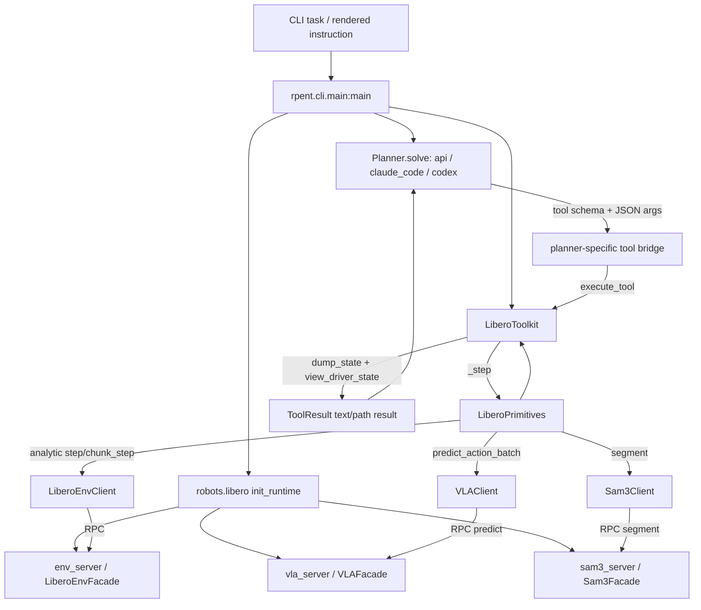
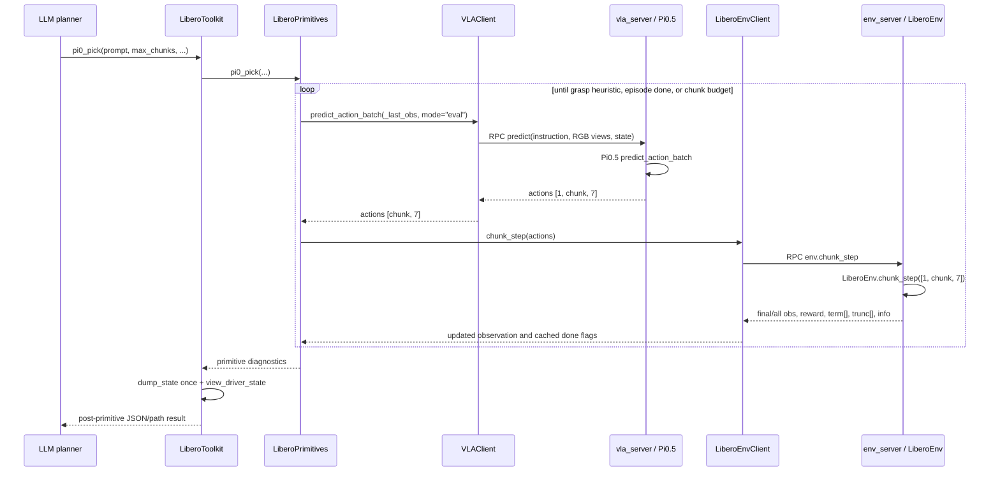

# RPent Codebase Guide for Controller-Handoff Research

> Purpose: source-anchored onboarding for future controller-handoff work. This
> guide prioritizes executable code over README inference and records uncertainty
> explicitly.

> Implementation update (2026-08-08): the opt-in controller-handoff pipeline is
> now implementation-complete and statically inspected. No test, simulator,
> model, Gate-0, GPU, or full-agent execution was performed in this pass; all
> external-runtime behavior and every research claim remain unverified.

## 1. Version and verification scope

| Item | Value |
|---|---|
| Repository branch | `main` |
| Commit | `97ad4ff6e922c9bfa258711b4be558a4cd7f6ecd` |
| Inspection date | 2026-08-08 (Asia/Shanghai) |
| Checkout-local user change observed before this task | untracked `docs/OVERVIEW.md` (read but not modified) |
| Runtime verification | source inspection only for LIBERO/Pi0.5; required RLinf, LIBERO runtime, MuJoCo, OmegaConf, Pi0.5, SAM3, and planner packages were not installed in the active Python environment |

Status terms used below:

- **Source-verified**: behavior follows directly from this commit's code.
- **Statically verified / runtime unverified**: the local path is complete, but
  the simulator/model dependency was unavailable.
- **Documented, not verified in source**: a README/guide or external package
  states the behavior, but this checkout does not contain the implementation.
- **Open**: the current checkout does not determine the answer.

The repository does not vendor the RLinf implementation imported by
`robots/libero/env_server.py` and `robots/libero/vla_server.py`; there is no git
submodule for it. Consequently, the RPent side of each boundary is source-verified,
while the inside of `rlinf.envs.libero.LiberoEnv` and
`rlinf.models.embodiment.openpi` remains runtime/external-source unverified.

## 2. Executive architecture summary

RPent is a synchronous tool-calling agent around three service processes:

- the **agent process** owns CLI orchestration, the LLM planner, `Toolkit`,
  `LiberoPrimitives`, local state artifacts, and analytic servo loops;
- **env_server** owns the single-environment RLinf/LIBERO simulator and EGL
  rendering;
- **vla_server** owns the frozen Pi0.5 weights and CUDA context;
- **sam3_server** owns the SAM3 checkpoint and CUDA context.

The planner does not call the simulator or VLA client directly. It sees tool
schemas and synchronously waits for one `ToolResult`. A physical tool may execute
many simulator steps before returning. For LIBERO, state/image artifacts are
dumped once at the end of each physical primitive, not after every internal env
step or Pi0.5 action chunk.

There is no tool literally named `vla_act` at this commit. The corresponding
learned-controller tools are `pi0_pick` and `pi0_doubled`.



## 3. End-to-end call path

### 3.1 Startup and task selection

| Step | Path and symbol | Input | Output | Caller and return boundary |
|---|---|---|---|---|
| CLI entry | `rpent/cli/main.py` → `main()` | CLI args | process exit code | console script from `pyproject.toml`; returns after planner, artifacts, and daemon cleanup |
| Environment resolution | `rpent/envs/base.py` → `_resolve_env()`, `get_env_spec()` | `env_name` (`libero` is the only CLI choice) | `robots.libero` module / `EnvSpec` | called by `main()` before final argparse pass |
| Run identity | `robots/libero/__init__.py` → `_parse_config()` | final argparse namespace | `RunConfig(recipe_tag, output_dir, prompt_vars, task_desc)` | called by CLI; no simulator access |
| Planner construction | `rpent/planner/base.py` → `build_planner()` | backend, model, output paths, limits | `ApiAgentLoop`, `ClaudeCodePlanner`, or `CodexPlanner` | called once per non-Dashboard run and once per Dashboard TaskRun |
| Runtime construction | `robots/libero/__init__.py` → `_init_runtime()` | suite/task/seed/endpoints/checkpoints/GPU flag | owned `ProcessDaemon` list plus `env`, `model`, `sam3_client` clients | called by `main()`; returns after all three services answer `healthz` |
| Toolkit construction | `robots/libero/__init__.py` → `get_toolkit()`; `robots/libero/toolkit.py` → `LiberoToolkit.__init__()` | clients in `primitives_kwargs`, event sink, video path | initialized toolkit with common, read-only, and physical tools | called by CLI before `Planner.solve()` |
| Initial observation | `LiberoToolkit.init_primitives_clean()` → `LiberoPrimitives.reset()` → `LiberoEnvClient.reset()` | none | initial policy observation plus state/image artifacts at toolkit step 0 | completes during toolkit construction |
| Planner loop | `rpent/planner/base.py` → `Planner.solve()` protocol and backend implementation | rendered system/user text, toolkit, turn limit | `PlannerResult` | CLI blocks until backend ends, times out, errors, or recognizes `finish` |
| Final artifacts | `rpent/cli/main.py` → `toolkit.write_recipe()`, `toolkit.close()`, transcript write | state trace and planner result | recipe JSONL, episode video, transcript, logs | occurs in cleanup; daemons stop afterward |

Source detail: `LiberoEnvClient.__init__()` calls `reset()` once to initialize its
termination flags and validate the service; `LiberoToolkit` then constructs
`LiberoPrimitives` and calls `LiberoPrimitives.reset()` again. Thus toolkit startup
causes two env reset RPCs. The effect of two resets on a given external RLinf
benchmark is **runtime unverified**.

### 3.2 Dashboard variant

`rpent/cli/dashboard.py` changes process lifetime, not the primitive contract:

- `run_dashboard_session()` calls `EnvSpec.init_shared_runtime()` once. LIBERO
  keeps the Pi0.5 and SAM3 services alive across tasks.
- `_run_dashboard_task()` calls `EnvSpec.init_task_runtime()` for a fresh
  env_server for each TaskRun, then builds a new toolkit and planner.
- `DashboardSessionController.run()` in `rpent/dashboard/session.py` executes one
  claimed TaskRun at a time.
- Dashboard task control forbids an external `--env-endpoint`, because a fresh
  owned env is part of the TaskRun contract. External VLA/SAM3 endpoints remain
  supported.

The VLA server exposes no episode reset RPC at this commit. Its model object is
reused across Dashboard tasks. The code appears to treat inference as stateless;
whether the external model implementation keeps hidden episode state is **open**.

## 4. Planner tool bridges and control return

All backends ultimately call `Toolkit.execute_tool(name, input_dict)`, but the
bridge differs:

| Backend | Schema exposure and dispatch | Finish detection | When the planner can act again |
|---|---|---|---|
| API | `rpent/planner/api_loop.py` → `_build_tools()` creates PydanticAI tools; `_make_tool_function()._call()` calls `toolkit.execute_tool()` directly | `_ApiRunObserver.observe_tool()` records `finish` from the tool-call arguments | after the synchronous tool function returns content to the PydanticAI stream |
| Claude Code | `rpent/planner/claude_code.py` → `_build_rpent_server()` creates an in-process SDK MCP server; `run_tool()` calls `execute_tool()` via `asyncio.to_thread()` under a tool lock | `_Recorder` promotes a pending `finish` only when its non-error tool result arrives | after the MCP result is returned; the SDK session then produces its next message |
| Codex | `rpent/planner/codex.py` starts `HttpMcpServer`; `rpent/planner/utils/http_mcp_server.py` → `_call_tool()` dispatches in an executor | `_Recorder._maybe_capture_finish()` accepts a completed, non-error finish item | after the MCP result; the current Codex turn/session owns the remaining stop timing |

Important backend differences:

- Claude explicitly serializes toolkit execution with an `asyncio.Lock`.
- Codex's MCP server can receive calls on concurrent HTTP/executor paths; the base
  toolkit does not queue them. `Toolkit.execute_tool()` returns
  `{"error": "another tool operation is still active"}` to an overlapping call.
- API detects `finish` from call arguments, even though the handler also executes.
  Claude and Codex wait for a successful result item.
- `finish(status, summary)` is an LLM-declared run status. It is not the LIBERO
  task-success predicate.

During a physical tool, the LLM does not participate in internal env steps or VLA
chunks. Dashboard/timeout cancellation is cooperative: `Toolkit.cancel_active_and_wait()`
sets a flag, and the active primitive must reach `raise_if_cancelled()` before it
returns. The planner only sees the final returned result.

## 5. Primitive system

### 5.1 Definition and registration

The source of truth is:

1. `robots/libero/tools.py` → `TOOLS_SPEC`: canonical Anthropic-shaped schemas.
2. `robots/libero/tools.py` → `LiberoPrimitives`: physical/read-only method
   implementations.
3. `robots/libero/tools.py` → `PRIMITIVE_TOOL_NAMES`: physical tools routed through
   the state-dumping wrapper.
4. `robots/libero/toolkit.py` → `LiberoToolkit._register_libero_tools()`:
   inspection tools are bound directly; every physical primitive is bound to
   `partial(self._step, name)`.
5. `rpent/tools/toolkit.py` → `Toolkit.add_tool()` and `get_tools_spec()`:
   store and expose the schemas.

The current physical primitive names are:

```text
move_to, pi0_pick, pi0_doubled, release, set_gripper,
rotate_wrist, rotate_pitch, move_pose
```

The read-only LIBERO tools are `view_driver_state`, `view_camera_meta`,
`back_project`, and `segment`. Common tools from `rpent/tools/common.py` are
`read_text_file`, `write_text_file`, `list_dir`, and `finish`.

### 5.2 Physical primitive lifecycle

For a call such as `move_to({"xyz": [...]})`:

1. The planner bridge supplies the JSON object to
   `Toolkit.execute_tool("move_to", input_dict)`.
2. `execute_tool()` establishes one active operation and invokes the registered
   handler synchronously.
3. `LiberoToolkit._step("move_to", **kwargs)` records command metadata and calls
   `LiberoPrimitives.move_to(**kwargs)`.
4. The primitive may call `env.step()` many times, updating `_last_obs` after
   every step.
5. `_step()` increments the **tool/primitive step index once**, calls
   `dump_state()` once, then calls `view_driver_state(step_idx)`.
6. The returned planner-visible dict contains post-primitive state, status flags,
   artifact paths, and the primitive's small result under `log.result`.
7. `Toolkit.execute_tool()` wraps it as `ToolResult`, emits a Dashboard event,
   clears the active operation, and returns to the planner bridge.

Thus an analytic primitive can and does execute multiple environment steps while
the LLM is blocked. “Step” in `states.json` is a primitive/tool step, not an env
step.

### 5.3 Result, failure, success, and exception semantics

`Toolkit.execute_tool()` handles failures as follows:

- unknown tool → top-level `{"error": "unknown tool: ..."}`;
- Python `TypeError` from bad arguments → top-level structured error;
- any other uncaught exception → top-level error plus traceback;
- normal dict result → returned as-is.

Claude/Codex MCP adapters mark a top-level `error` result as a tool error. The API
adapter returns its JSON text/content but does not add a separate RPent error
flag.

There is a subtle LIBERO distinction: a primitive method may itself return a dict
containing `error` (for example, missing rotation arguments). Because
`LiberoToolkit._step()` nests that dict at `log.result`, the planner-visible
top-level dict is not marked as an MCP error. It is still visible to the LLM, but
only as `log.result.error`.

If a primitive raises before `_step()` reaches `dump_state()`, the base toolkit
returns the exception but no new `states.json` entry or post-error render is
guaranteed. This matters for outcome collection: exception outcomes cannot be
reconstructed solely from the state trace.

There is no uniform primitive-success interface:

- analytic moves return diagnostics such as `final_dist_m`, `steps_used`, and
  `libero_terminated`, not a common `success` flag;
- `pi0_pick.success` is primarily a grasp heuristic checked after each chunk;
  only when that heuristic is false does the same iteration map an episode-done
  condition to `episode_terminated`;
- `pi0_doubled.success` and `task_success` mirror official LIBERO termination;
- `finish.status` is chosen by the LLM;
- official task success as represented in RPent is `LiberoEnvClient.episode_terminated`.

An outcome dataset must preserve these separate concepts rather than collapsing
them into one Boolean.

### 5.4 Observation return and images

`dump_state()` writes robot state and artifact paths. `view_driver_state()` returns
those paths and JSON fields. At this commit, it does **not** insert
`_image_bytes`, `_image_cam_bytes`, or `_image_wrist_bytes`, so `ToolResult` does
not automatically inline LIBERO images into the tool result.

- The API planner exposes an additional `read_image(path)` tool.
- Claude Code and Codex operate with filesystem-capable SDK tooling and can open
  returned image paths.
- The Dashboard reads the artifact paths from events.

Control returns to the planner only after state dump and high-resolution rendering
attempts have completed.

## 6. Learned-controller path (`pi0_pick` / `pi0_doubled`)

### 6.1 Complete call chain



Exact path and transformations:

1. `LiberoPrimitives.pi0_pick()` or `pi0_doubled()` loops over action chunks.
2. `LiberoPrimitives._vlm_chunk()` temporarily replaces
   `_last_obs["task_descriptions"]` with the tool's sub-instruction.
3. `rpent/utils/vla_client.py` → `VLAClient.predict_action_batch()` sends:
   - required `main_images` as PNG/base64;
   - optional `wrist_images` and `extra_view_images` as PNG/base64;
   - the entire one-dimensional `states` vector as `[B=1, state_dim]`;
   - the sub-instruction and `mode="eval"`.
4. RPC uses `predict` on `robots/libero/vla_server.py` → `VLAFacade.predict()`.
5. `_build_env_obs()` restores batched arrays and calls the external OpenPI model's
   `predict_action_batch()` under `torch.no_grad()`.
6. The server returns JSON-safe actions. `VLAClient` strips batch dimension 0.
7. `_vlm_chunk()` passes the complete chunk to `LiberoEnvClient.chunk_step()`.
8. `robots/libero/env_server.py` → `LiberoEnvFacade.chunk_step()` adds the single
   env dimension and calls external `LiberoEnv.chunk_step()` once.
9. The latest observation becomes `_last_obs`; the outer primitive loop evaluates
   its stop condition only after the full chunk RPC returns.

### 6.2 Action chunk size and inference cadence

`robots/libero/vla_server.py` → `build_model_cfg()` sets all of the following:

```text
num_action_chunks = 5
action_dim = 7
openpi.action_chunk = 5
openpi.action_env_dim = 7
num_steps = 5
```

Statically, one inference is therefore configured to return a five-action chunk,
and each action has seven dimensions. The actual model return shape is emitted by
the server as `shape` and is expected by the client as `[1, chunk, 7]`. This was
not executed locally against the checkpoint, so exact runtime conformance is
**runtime unverified**.

`pi0_pick` defaults to 24 chunks (up to 120 actions at the configured size), while
`pi0_doubled` defaults to 20 chunks (up to 100 actions). A fresh model inference
occurs before every chunk.

### 6.3 Can a chunk be interrupted?

On the agent side, no. `_vlm_chunk()` has cancellation checks:

1. before inference;
2. after inference and before `env.chunk_step()`.

There is no cancellation or outcome check between actions inside that RPC. The
env server calls external `LiberoEnv.chunk_step()` for the whole chunk and only
then returns per-action termination/truncation arrays. Whether the external
implementation internally stops stepping after the first done signal is **open**;
that source is not in this checkout.

When recording is enabled, `_vlm_chunk()` requests all per-action observations so
it can append video frames, but these frames are not presented to the governor or
planner mid-chunk.

### 6.4 Primitive termination and success

`pi0_pick()` returns when:

- it observes descent of at least 0.10 m, subsequent ascent of at least
  `lift_thresh`, and its gripper-opening proxy is below
  `gripper_closed_thresh`; or
- the environment is terminated/truncated; or
- `max_chunks` is exhausted; or
- an exception/cancellation escapes.

The check order matters: after each chunk the grasp heuristic is evaluated first;
only if it is false does the method check termination/truncation and assign
`success = episode_terminated`. Consequently, a chunk that both satisfies the
heuristic and triggers truncation can still return `success=true` while
`libero_terminated=false`. This is primitive-level evidence, not proof that the
correct object was grasped and not necessarily full task success. Consumers must
retain the primitive flag, official termination, and truncation separately.

`pi0_doubled()` has no intermediate contact-success detector. It returns success
only when official LIBERO termination occurs; an intermediate articulation may
have worked even when its returned `success` is false.

### 6.5 Natural interception points

| Point | Current granularity | Suitability |
|---|---|---|
| Before planner emits a learned tool | one LLM turn | existing semantic boundary; too slow/coarse for the proposed physical switching loop |
| `LiberoToolkit._step()` before calling a primitive | one tool call | can route an opt-in composite primitive, but has no fast loop by itself |
| `LiberoPrimitives._step_env()` | every analytic env step | best existing safe boundary for local staging feedback and cancellation |
| Between iterations in `move_to` / `move_pose` / rotation loops | every analytic env step | natural place to extract candidate handoff states and decide continue/handoff |
| `_vlm_chunk()` before model inference | every learned chunk | natural handoff boundary after staging and before learned control starts |
| `_vlm_chunk()` after inference, before `chunk_step()` | every learned chunk | can reject an inferred chunk, but inference cost is already paid |
| Between Pi0 chunk-loop iterations | five actions by static config | useful for learned-controller monitoring after handoff, but not sub-action intervention |
| Inside `LiberoEnvFacade.chunk_step()` | currently one external full-chunk call | finer monitoring would require a more invasive env/external-RLinf change |
| VLA server | inference only | lacks analytic action execution and environment outcomes; not recommended for governor ownership |

For the initial research question—**when to transfer control before VLA
execution**—the best insertion point is the agent-side local primitive loop,
immediately before the first `_vlm_chunk()` call. Fine-grained intervention after
handoff is a separate later problem.

## 7. Analytic control

### 7.1 Implemented methods

| Method | Feedback and frame | Generated action | Internal stepping | Return evidence |
|---|---|---|---|---|
| `LiberoPrimitives.move_to()` | `_last_obs["states"][:3]` as current EEF world XYZ; optional raw EEF quaternion for yaw | 7-D delta action: XYZ in `action[:3]`, optional yaw in `action[5]`, gripper in `action[6]` | repeated `env.step()` until tolerance, done, or `max_steps` | final pose/distance, steps, termination |
| `rotate_wrist()` | `raw_obs()["robot0_eef_quat"]`, interpreted as XYZW; world yaw from rotation matrix | `action[5]` plus gripper | per-step yaw feedback | start/target/final yaw and error |
| `rotate_pitch()` | raw EEF quaternion; project-specific world-X pitch definition | `action[3]` plus gripper | per-step pitch feedback | start/target/final pitch and error |
| `move_pose()` | EEF XYZ plus raw quaternion | XYZ, pitch, and yaw together in `action[:3]`, `[3]`, `[5]`; gripper `[6]` | per-step position/orientation feedback | final pose metrics and termination |
| `release()` | gripper proxy from `_last_obs["states"][6:8]` | zero motion with `action[6] = -1` | fixed step budget or episode done | opening diagnostics and termination |
| `set_gripper()` | same proxy | zero motion with caller-supplied `action[6]` | fixed step count or episode done | command/count and termination |

There is no separate transport/staging primitive in this commit. Transport is an
LLM-orchestrated sequence of `move_to`/`move_pose` while holding
`gripper=+1`. Staging can reuse the same servo methods or their per-step action
construction.

### 7.2 What the analytic methods do not provide

- No motion planner, collision checker, explicit reachability query, joint-limit
  margin, or IK feasibility interface exists in RPent source.
- No analytic method consumes RGB, depth, segmentation, or point clouds inside
  its feedback loop. Perception happens before/between tool calls, typically via
  `segment`/`back_project` and LLM reasoning.
- Workspace safety limits described in prompts/guides are empirical guidance, not
  server-side clamps in `LiberoEnvFacade.step()`.
- `build_env_cfg()` does not explicitly choose an OSC controller in RPent. The
  method docstrings describe OSC_POSE scaling, but the precise external controller
  selection and action scaling are **documented/static-call-site evidence, not
  verified inside the external RLinf implementation**.
- SciPy is imported lazily by rotation/move-pose methods but is not a direct base
  dependency in `pyproject.toml`; the full simulator stack is expected to provide
  it transitively.

The servo loops are small-step and proprioceptively closed-loop, so they can be
reused for early staging experiments. They are not image-based receding-horizon
controllers and do not by themselves generate collision-aware trajectories.

## 8. Observation and embodied-state availability

### 8.1 Layer matrix

| Information | LLM planner | Toolkit / `LiberoPrimitives` | Env client/server | VLA input | Deployment/privilege note |
|---|---|---|---|---|---|
| Task instruction | rendered prompt and `task_language` | `_last_obs.task_descriptions`; `get_task_language()` | server reads external `task_descriptions` | current sub-instruction | deployment-realistic |
| Agentview RGB | path from state dump; must be opened separately | `_last_obs.main_images`; raw `agentview_image`; render RPC | raw/current obs and render API | required `main_images` | deployment-realistic camera |
| Wrist RGB | path when available | `_last_obs.wrist_images` and raw `robot0_eye_in_hand_image` | raw/current obs and render API | optional `wrist_images` | deployment-realistic camera |
| Extra-view RGB | not separately surfaced by LIBERO state view | `_last_obs.extra_view_images` if external env supplies it | external obs-dependent | optional | availability open |
| Depth | paths/world-map tools, not inline numeric array | raw agent/wrist depth; dumped `.npy`; back-projection helpers | configured with `camera_depths=True`; render depth API | not sent | deployment-realistic with RGB-D hardware |
| Intrinsics/extrinsics | `view_camera_meta` and JSON paths | `get_camera_meta()`; used to compute world maps | server delegates to external env | not sent | calibratable/deployment-realistic; wrist extrinsic is per-step |
| EEF position | `states.json.state.robot0_eef_pos` | `_last_obs.states[:3]` and raw key | raw obs | included only indirectly in full `states` vector | deployment-realistic proprioception |
| EEF orientation | `robot0_eef_quat` | raw quaternion; `_last_obs.states` also has unresolved orientation fields | raw obs | full `states` vector | deployment-realistic, exact state layout open |
| Gripper state | `robot0_gripper_qpos` | raw qpos; proxy from `_last_obs.states[6:8]` | raw obs | full `states` vector | deployment-realistic |
| Full robot joint state | not exposed in `dump_state()` | potentially present in raw obs, not used or guaranteed | external raw-obs dependent | exact inclusion unknown | **open**; do not assume joint margins exist |
| Object names | exposed as names only | inferred from raw keys ending `_pos` | raw obs contains compatible keys when runtime matches assumptions | not explicitly sent except visual/language context | simulator-derived metadata as implemented; do not treat as a real perception output automatically |
| Object poses | intentionally withheld from planner | `raw_obs()` RPC can expose the full external raw dict; dump code deliberately filters poses | likely external raw obs; exact keys runtime-dependent | not explicitly sent | simulator-only privileged unless produced by deployment perception |
| Predicted segmentation | result/artifact from `segment` | SAM3 client plus mask/world-map projection | not an env API | not sent | deployment-realistic only if SAM3 is available; not GT segmentation |
| Simulator GT segmentation | not exposed | no RPent API found | external simulator may support it, but RPent does not surface it | not sent | simulator-only; availability open |
| Contacts/collisions | not exposed | no RPent API found | no facade/client method | not sent | simulator-only or robot-sensor dependent; currently unavailable |
| Reward | not shown in state dump | discarded into `_r` by primitives | returned by step/chunk RPC | not sent | evaluator signal currently not logged per primitive |
| Task termination | `libero_terminated` | cached client flag | term vector returned by env | not sent | simulator/evaluator label; do not use as a deployment policy feature |
| Truncation | `episode_truncated` | cached client flag | trunc vector returned by env | not sent | evaluator/runtime label |
| Hidden simulator model/data | not exposed | no direct agent API | exists inside external env process but is not defined by RPent | not sent | privileged and out of scope |

### 8.2 What `dump_state()` exposes

`robots/libero/tools.py` → `dump_state()` calls `env.raw_obs()` once after a
primitive and deliberately writes only:

```text
robot0_eef_pos
robot0_eef_quat
robot0_gripper_qpos
object_names (derived from raw key names, without coordinates)
```

It also writes task language, termination/truncation flags, command/result/time,
low-resolution RGB-D/world maps, moving wrist calibration, and high-resolution
RGB/world maps. High-resolution files older than the most recent five tool steps
are deleted; low-resolution history and `states.json` remain.

The `raw_obs()` RPC itself is broader than the planner state view. The opt-in
handoff adapter therefore extracts an explicit deployment whitelist and attaches
per-field provenance rather than serializing the raw dict. Ground-truth object
coordinates remain setup/label-side only.

### 8.3 VLA observation contract

The Pi0.5 RPC receives only:

- instruction text;
- main RGB, optional wrist RGB, optional extra-view RGB;
- the external environment's complete `states` vector;
- inference mode.

It does not receive RPent's depth arrays, camera calibration, SAM3 masks,
back-projected world maps, object-pose keys, reward, termination, or contacts.
`build_model_cfg()` sets `use_proprio=True` and `num_images_in_input=2`, but the
external observation processor and exact `states` semantics are not vendored.

## 9. Memory, traces, and failure information

### 9.1 Current memory is textual and curated

`rpent/utils/resources.py` → `ensure_resources()` optionally downloads the
environment subtree of the `RLinf/RPent-memory` Hugging Face dataset to
`resources/<env>/`. `HF_HUB_OFFLINE=1` skips syncing. Sync failures are warnings,
not fatal.

The two documented layers are:

- task-specific reference audits and `recipe_*.jsonl` under directories such as
  `resources/libero/results_*_pert/`;
- cross-task Markdown notes under `resources/libero/memory/`, indexed by
  `MEMORY.md`.

Their concrete access path is prompt- and filesystem-based:

- `robots/libero/prompts/system.py` and `robots/libero/prompts/user.py` instruct
  the planner to inspect `MEMORY.md`, related notes, and task-matched reference
  audits/recipes.
- The API backend can read them with `read_text_file` / `list_dir` registered from
  `rpent/tools/common.py`.
- `rpent/planner/base.py` → `build_planner()` gives Claude Code and Codex the
  environment memory directory through `extra_dirs`; those SDK agents use their
  filesystem tools.
- At run end, an audit is written only if the LLM follows the prompt and calls
  `write_text_file`; the runner independently exports a recipe in
  `rpent/cli/main.py` or `rpent/cli/dashboard.py` cleanup.

There is no memory database, embedding index, structured update API, outcome
learner, or automatic promotion from a run into shared memory in this repository.
The development guide describes a human review/publisher step before run outputs
enter `results_*_pert/` or `memory/`; the repository has no self-service upload
path. The `resources/` corpus was absent from this checkout during inspection.

### 9.2 Per-run traces

| Artifact | Writer | Contents and limitations |
|---|---|---|
| `states.json` | `dump_state()` / `_append_state()` | one record per physical primitive, not per env step/chunk; command, nested result, elapsed time, selected robot state, task flags, artifact paths |
| `recipe_*.jsonl` | `write_recipe_from_states()` at cleanup | non-error physical primitive commands plus successful segment commands; no perception/file tools |
| task audit JSON | LLM via `write_text_file` according to prompt | free-form/semistructured strategy and final status; not guaranteed if the agent errors |
| `transcript_*.json` | CLI/Dashboard cleanup | task identifiers, model, elapsed time, finish result, stats, planner transcript |
| planner stream files | Claude/Codex planners | backend-specific raw event JSONL and rendered text |
| `run.log`, service logs | logging/daemon code | agent, env, VLA, and SAM3 diagnostics |
| episode/action videos | `LiberoPrimitives` / Dashboard | per-env-step RGB buffer; action clips only when Dashboard event sink is enabled |

Despite `write_recipe_from_states()`'s docstring, the implementation does not
require final `libero_terminated=True`; it exports every non-error primitive in
the trace whenever cleanup runs. A recipe is therefore not proof of success.

Failure information is fragmented:

- normal primitive `success=False` or high `final_dist_m` lives in nested
  `states.json.log.result`;
- uncaught tool exceptions live in the returned tool result/transcript and may
  have no new state entry;
- RPC server tracebacks are carried by `RpcError` but are string diagnostics;
- an audit is authored by the LLM and may be absent;
- rewards and per-action/chunk outcomes are not retained in the state trace.

### 9.3 Implemented Handoff Outcome Dataset

The research module now stores a versioned structured record with the logical
shape

```text
(schema_version, episode_id, invocation_id, skill, z,
 outcome, execution_cost, termination_reason, feature_provenance, metadata)
```

It is **decoupled from textual LLM memory** and has checksummed append-only
envelopes, strict readers, conflict/torn-tail detection, explicit label
exclusions, and separate decision/outcome streams. Both positive and negative
real execution outcomes are retained. This is statically verified design; its
durability under real server/process failures is not yet runtime-verified.

## 10. Environment, LIBERO, and Pi0.5 runtime

### 10.1 LIBERO selection and reset

`robots/libero/env_server.py` → `make_env()`:

1. imports the selected external benchmark;
2. calculates a reset-state id by summing prior tasks' initialization-state
   counts and selecting `seed % trials` for the requested task;
3. builds an OmegaConf with `num_envs=1`, evaluation mode, fixed/ordered reset
   ids, depth cameras at 256×256, and the episode horizon;
4. constructs external `rlinf.envs.libero.libero_env.LiberoEnv`.

`--suite`, `--task`, `--seed`, `--libero-type`, and
`--max-episode-steps` enter through `robots/libero/__init__.py`.
`--libero-type` becomes the `LIBERO_TYPE` subprocess environment variable.

### 10.2 Service boundaries

| Service | Agent-side client | Server facade and methods | Heavy requirements |
|---|---|---|---|
| Environment | `robots/libero/env_client.py` → `LiberoEnvClient` | `LiberoEnvFacade`: `reset`, `step`, `chunk_step`, `raw_obs`, render/meta/task-language/cached-image | RLinf LIBERO package, chosen LIBERO variant/assets, MuJoCo/robosuite, EGL; torch is imported by external env |
| VLA | `rpent/utils/vla_client.py` → `VLAClient` | `VLAFacade`: `predict` | RLinf OpenPI package, OmegaConf, torch/CUDA, Pi0.5 checkpoint |
| Segmentation | `rpent/utils/sam3_client.py` → `Sam3Client` | `Sam3Facade`: `segment` | SAM3 package, torch/CUDA, SAM3 checkpoint, Pillow |

All facades inherit `rpent/utils/rpc.py` → `RpcFacade`, which provides
`healthz`, shutdown coordination, and either HTTP or socket serving. The default
runner uses HTTP. HTTP encodes NumPy arrays as base64-tagged JSON; socket mode uses
pickle and is intended only for trusted endpoints.

Services can be spawned locally or attached through
`--env-endpoint`, `--vla-endpoint`, and `--sam3-endpoint`. Endpoint protocols are
`http` or `socket`.

### 10.3 GPU/process ownership

- `vla_server`: explicitly loads the model with `.cuda().eval()`; GPU required.
- `sam3_server`: refuses startup unless `torch.cuda.is_available()`; GPU required.
- `env_server`: owns MuJoCo EGL rendering. Documentation requires Linux with an
  NVIDIA GPU. `--cuda-device` maps CUDA ordinal to EGL device and also calls
  `torch.cuda.set_device()`.
- agent/planner/toolkit process: does not load simulator or VLA weights; analytic
  loops and artifact processing are CPU-side, while the LLM may be a remote API.

The same `--cuda-device` is passed to all locally spawned services. This can put
Pi0.5, SAM3, and EGL rendering on one GPU; memory/throughput implications require
server testing.

### 10.4 Success, termination, and logging

`LiberoEnvClient.check_done()` ORs any term/trunc value returned by a step or
chunk into persistent episode flags. Further step/chunk calls assert that neither
flag has fired.

- `episode_terminated`: RPent's official LIBERO task-success signal.
- `episode_truncated`: horizon/other truncation, not success.
- primitive success: method-specific as described earlier.
- `finish.status`: planner declaration, which can disagree with environment state.

No code currently enforces equality among these signals. Evaluation should use
official environment termination plus explicit consistency checks.

## 11. Windows-local versus Linux GPU-server boundary

### 11.1 Current Windows facts

The active machine used Python 3.11.5. `torch` was installed, but probes found no
active environment packages for `rlinf`, `libero`, `mujoco`, `omegaconf`,
`pydantic_ai`, `openai_codex`, or `sam3`. No packages were installed and no
checkpoints/resources were downloaded during this task.

Full runtime support is explicitly Linux-oriented:

- `docs/source-en/rst_source/installation.rst` requires Linux, NVIDIA GPU,
  CUDA 12.x, `bash`, and a C toolchain;
- env startup forces `MUJOCO_GL=egl` and `PYOPENGL_PLATFORM=egl`;
- EGL device discovery uses MuJoCo/OpenGL NVIDIA extensions;
- the quick-start and helper scripts are Bash-centric;
- RLinf/LIBERO/OpenPI wheel/platform compatibility is not established for native
  Windows.

There is also a direct Windows path bug: both `robots/libero/__init__.py` and
`rpent/cli/dashboard.py` generate default directory names with
`datetime.strftime("%Y%m%d-%H:%M:%S")`. `:` is invalid in Windows path components.
An explicit `--output-dir` avoids only this path issue; it does not make the full
EGL stack Windows-compatible.

### 11.2 Safe local work now

Without simulator/GPU setup, Windows can support:

- pure-Python handoff dataclasses, enums, protocols, feature provenance, and
  schema/version logic;
- deterministic decision rules and mocked Outcome Model implementations;
- append-only outcome logging and offline dataset readers using synthetic data;
- calibration metrics and evaluator logic over fixture records;
- fake env/VLA adapters and unit tests for continue/handoff transitions,
  exception outcomes, termination distinctions, and baseline isolation;
- static parsing/linting and documentation;
- RPC/client tests with tiny fake local servers if base dependencies are present.

The two existing tests do not require MuJoCo or a GPU in design, but they import
`pydantic_ai`; they cannot be collected in the currently active Python environment
until declared base dependencies are installed. New core research tests should
avoid importing `robots.libero.env_server` or model servers.

### 11.3 Defer to the Linux GPU server

Defer all of the following:

- installing `.[full]`, RLinf/OpenPI/LIBERO-PRO/SAM3 and native simulation
  dependencies;
- downloading LIBERO assets, Pi0.5, or SAM3 checkpoints;
- verifying actual Pi0.5 action shapes and observation preprocessing;
- MuJoCo/EGL environment launch and real camera/depth artifacts;
- real rollout collection, action-chunk termination behavior, Gate-0 experiments,
  outcome calibration, and baseline parity;
- GPU memory placement and multi-service concurrency measurements.

WSL2 is the more appropriate local compatibility layer if Linux-parity testing is
needed, but the planned remote Linux GPU server remains the authoritative runtime.
There is no value in installing the full simulator/model stack in native Windows
for Task 0.

## 12. Recommended handoff integration architecture

### 12.1 Preferred boundary

The implementation uses an **opt-in local/composite LIBERO primitive in the agent process**, built on
the existing per-env-step analytic primitives and invoking the unchanged
`pi0_pick`/`pi0_doubled` path only after the governor chooses handoff.

Why this boundary fits:

- the LLM can commit once to a semantic skill;
- the local primitive already owns the env and VLA clients;
- `_step_env()` gives a fresh observation and cancellation point per analytic
  step;
- the governor can compare continue/handoff before paying VLA inference cost;
- the current action-chunk executor can remain unchanged initially;
- no research logic needs to enter the planner, VLA server, or simulator server.

`LiberoToolkit._run_physical_step()` remains the outer tool lifecycle: one
planner call enters the composite primitive, a local loop stages/observes/decides,
then the existing learned primitive runs, and one final planner-facing state dump
is returned. A separate rollout logger must preserve internal candidate states and
outcomes because `states.json` is too coarse.

### 12.2 Implemented module split

```text
rpent/research/handoff/
    types.py          # versioned state, outcome, decision, cost, identity records
    privileged.py     # setup/label-only namespace and provenance firewall
    features.py       # strict feature specs/builders and representation ablations
    model.py          # probabilistic, calibrated, and bootstrap outcome models
    policies.py       # direct/fixed/retrieval/model-based/main/oracle policies
    governor.py       # bounded observe/decide/stage/re-observe/handoff machine
    dataset.py        # checksummed append-only outcome/decision stores
    training.py       # grouped split, train/calibrate/test, artifact reporting
    experiments/      # manifests, Gate-0, controlled/full-agent runners, probes
    evaluation/       # metrics, grouped statistics, aggregation, plotting

robots/libero/
    handoff.py        # deployment state adapter, target providers, composite tools
    handoff_runtime.py # strict opt-in config, IDs, sinks, factory validation
    handoff_experiments.py # live Gate-0 adapter and server entry path
```

The implemented dependency direction is:

```text
pure research core <- thin LIBERO adapter <- existing LiberoPrimitives/clients
```

### 12.3 Existing abstractions to reuse

- `Toolkit.add_tool()` / `get_tools_spec()` / `execute_tool()` for an opt-in
  composite tool;
- `LiberoToolkit._step()` for final post-tool state/artifact reporting;
- `LiberoPrimitives._step_env()` and the scripted servo action construction for
  local staging;
- `LiberoPrimitives.pi0_pick()` / `pi0_doubled()` as the unchanged learned
  execution path after handoff;
- `LiberoEnvClient` termination cache and RPC isolation;
- output-directory/logging conventions and Dashboard events for observability;
- current RGB-D, camera calibration, world-map, and SAM3 utilities where their
  deployment-realistic provenance is preserved.

### 12.4 Implemented research abstractions

- explicit feature whitelist/provenance and a LIBERO `HandoffState` extractor;
- current-observation SAM3, injected deployment, and explicit oracle target
  providers;
- structured outcome/cost/termination records at decision and VLA-invocation
  granularity;
- model and decision protocols isolated from simulator/model-server imports;
- a bounded local governor with explicit cancellation, staging, perception,
  budget, RPC, termination, and truncation outcomes;
- distinct `handoff_pi0_pick` / `handoff_pi0_doubled` tools that delegate learned
  execution to the unchanged primitives;
- checksummed datasets/artifacts, grouped evaluation, and parity-oriented tests.

Baseline `segment()` still operates on dumped artifacts. The opt-in adapter adds
`Sam3Client.segment_image()` so each governor observation can use the current RGB
frame without waiting for the outer tool dump. Depth back-projection and all
camera conventions remain server-runtime-unverified and are checked by the
runtime probe before collection. Simulator object coordinates are not routed
through this online path.

### 12.5 Existing files touched by the opt-in integration

The implementation makes these small, gated changes:

- `robots/libero/__init__.py`: add/validate opt-in handoff configuration and pass
  it into toolkit construction;
- `robots/libero/toolkit.py`: instantiate the baseline primitives by default and
  conditionally register a distinct composite tool/state logger;
- env/VLA/SAM3 clients and servers: additive runtime-probe methods plus an
  in-memory SAM3 call; normal RPC methods remain intact;
- `pyproject.toml`: optional `handoff` dependencies and the `rpent-handoff`
  console entry point;
- research tests, JSON configs, and documentation.

No governor logic was added to the upstream primitive implementation in
`robots/libero/tools.py`.

### 12.6 Baseline isolation and fair comparison

1. Default mode constructs the exact current `LiberoPrimitives`, schemas, and
   tool set.
2. Handoff mode uses a distinct tool name and explicit config; never monkey-patch
   or replace `pi0_pick` globally.
3. Store controller mode, schema version, model/checkpoint identity, suite/task/
   seed, budgets, and feature provenance in every outcome/episode record.
4. Use separate output roots or unmistakable metadata; never write research
   outcomes into `resources/libero/memory/` automatically.
5. Add a baseline parity test asserting identical registered tools/config/results
   when the feature is disabled.
6. Run Original Harness VLA and handoff conditions with the same environment
   reset selection, task, seed, episode budget, frozen VLA checkpoint, and
   success evaluator.
7. Keep privileged labels in a separate namespace unavailable to the online
   feature builder.

### 12.7 Considered but not recommended insertion points

| Insertion point | Why not recommended |
|---|---|
| High-level planner loop | repeats LLM latency and preserves the semantic/tool heuristic the project is trying to replace; no per-env-step physical loop |
| A simple pre-`pi0_pick` gate in `Toolkit._step()` | can say yes/no once but cannot stage, observe, and compare `continue` versus `handoff now`; acceptable only as an early baseline |
| Modify `pi0_pick` in place | contaminates Original Harness VLA behavior and makes fair baseline reproduction difficult |
| VLA client/server | sees inference inputs but cannot execute analytic alternatives or observe their outcomes; couples governor changes to the frozen-model service |
| env_server / simulator | offers physics state but invites privileged leakage, ties the method to LIBERO, and lacks semantic/skill/outcome-model ownership |
| Inside external `LiberoEnv.chunk_step()` | high invasion and external dependency; useful only for later within-VLA monitoring, not necessary for pre-handoff switching |
| Current textual memory | curated, lossy, often positive-biased, and lacks stable structured failure/cost fields |
| Nearest successful pose retrieval as the runtime core | useful baseline, but violates the project's novelty guardrail if treated as the main method |

## 13. Runtime-unverified questions and their probes

The code paths exist, but the following remain unresolved until the Linux server
runbook is executed. They must not be silently assumed:

1. Exact external RLinf `LiberoEnv.chunk_step()` behavior after a termination
   occurs inside a five-action chunk.
2. Exact layout, units, and frame of every element in `_last_obs["states"]`; only
   EEF position `[:3]` and the gripper proxy `[6:8]` are established by RPent use.
3. Complete runtime key set of `current_raw_obs`, including which object poses and
   robot joints are present for standard/pro/plus variants.
4. External controller configuration, exact OSC action scaling, joint limits,
   reachability, and contact/collision availability.
5. Whether the actual Pi0.5 checkpoint always returns `[1,5,7]`, and whether all
   five actions are meaningful under every backend/config.
6. Which two images the external OpenPI observation processor actually consumes
   when main/wrist/extra availability varies.
7. Official termination predicate details for every LIBERO/PRO/plus suite and the
   exact truncation behavior at the episode horizon.
8. Whether VLA model state needs an explicit reset when a Dashboard session reuses
   the server across tasks.
9. Actual GPU memory/latency when env EGL, Pi0.5, and SAM3 share one CUDA device.
10. Contents and curation quality of the external `RPent-memory` corpus, absent
    from this checkout.
11. Whether simulator-derived `object_names` should be excluded from a strict
    real-deployment feature set or replaced with perception outputs.
12. Whether current analytic servos provide enough safe staging coverage before a
    collision-aware/reachability-aware controller becomes necessary.

The `probe-runtime` command records package/environment identity, safe observation
descriptors, state samples, reset identity, endpoints, checkpoints, CUDA/GPU
memory, configured and actual action shape (when explicitly enabled), camera/SAM3
contracts, and term/trunc shapes. Destructive within-chunk and isolated-session
hidden-state diagnostics require separate confirmation flags. Questions 10–12
need artifact inspection or empirical rollouts rather than simple introspection.
See `SERVER_RUNBOOK.md` for the exact order and stop conditions.
